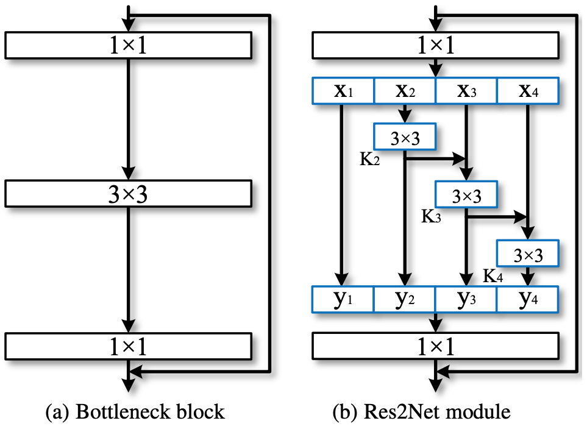
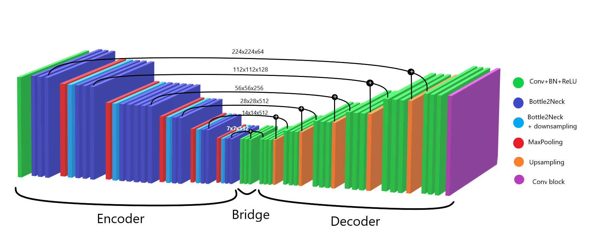
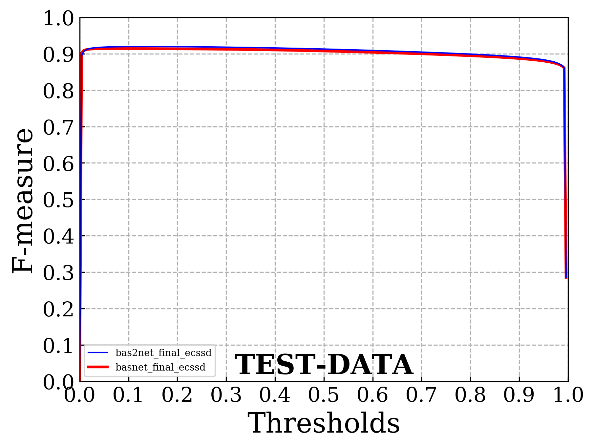
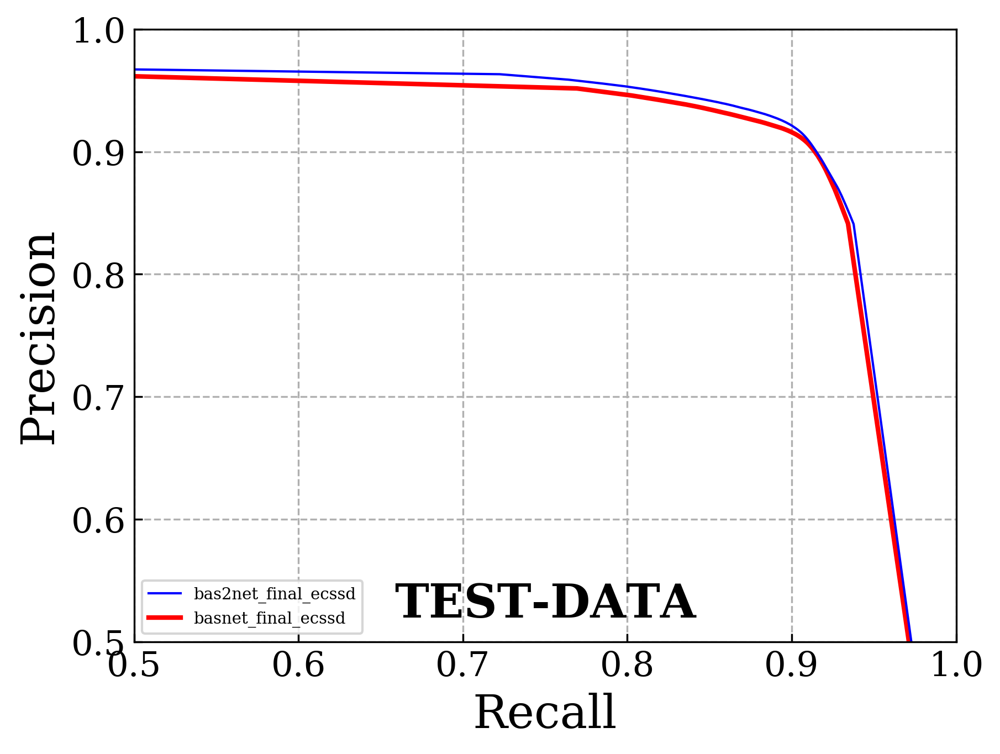
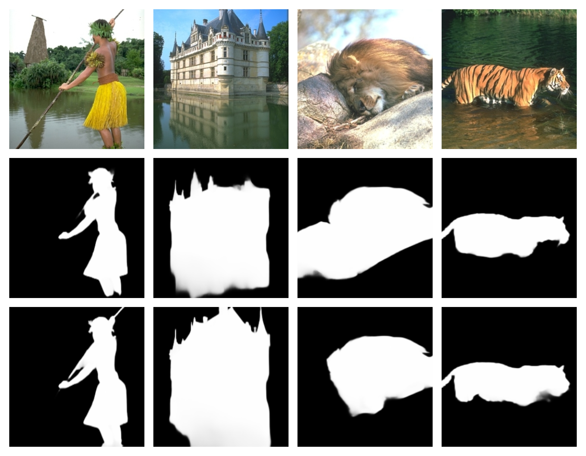
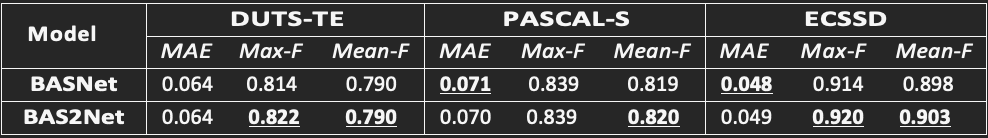

# Salient Object Detection: Bas2Net
Project for [Advanced Machine Learning](https://sites.google.com/di.uniroma1.it/aml-2021-2022) courses (A.Y. 2019/2020).

**Authors**: Irene Cannistraci and Giovanni Ficarra ([@GioFic95](https://github.com/GioFic95)).

Full details are available in the [slides](./slides.pdf) or in the [report](./report.pdf).

# Abstract
**Salient Object Detection** (SOD) is an emerging field in Computer Vision whose goal is to identify the most relevant objects in natural scenes, emulating the human vision system.
We developed a **new model** (BAS2Net) that combines two state‐of‐the‐art works in the Salient Object Detection field ([BASNet](https://openaccess.thecvf.com/content_CVPR_2019/papers/Qin_BASNet_Boundary-Aware_Salient_Object_Detection_CVPR_2019_paper.pdf) and [Res2Net](https://arxiv.org/pdf/1904.01169v3.pdf)). The resulting model requires 40% less training time, leading to better results on several datasets. Moreover, the proposed neural network is half the size of the original one. 

# Introduction
Salient Object Detection consists of two phases. First, input images are analyzed to detect the most significant object(s), and then they are accurately segmented based on the previous detection step. In SOD, it is essential to _understand the global image without neglecting more minor details_, which can be very relevant, especially in the segmentation step.

# Proposed method
We replaced ResNet blocks (called `basic block` in ResNet-34 and `bottleneck` in ResNet-50) with  the `bottle2neck`, which characterizes Res2Net-50.

The main difference between these two blocks is that in the second one, they introduce intermediate convolutional layers that are combined to produce a multi-scale representation of the input features.

The **new architecture** was the following:

# Experimental Results

## Datasets
BASNet was trained on the **DUTS** (that is divided into **DUTS-TR** and **DUTS-TE**) dataset and then used six different datasets to test it. To better compare our model with theirs, we decided to train BAS2Net on DUTS and then test it on three of the six datasets used by the author of the paper: [DUTS](http://saliencydetection.net/duts/), [PASCAL-S](http://cbs.ic.gatech.edu/salobj/.), and [ECSSD](http://www.cse.cuhk.edu.hk/leojia/projects/hsaliency/dataset.html).

## Metrics
We use the same metrics used in BASNet, the [Binary Segmentation Evaluation Tool](https://github.com/xuebinqin/Binary-Segmentation-Evaluation-Tool), comprising:
* _Mean Absolute Error_ (MAE)
* _Precision_, _Recall_, _F-measure_
* _Precision-recall curves_
* _F-measure curves_

## Experiments and Evaluation

### Training (DUTS-TR)
To compare the results of BAS2Net with BASNet, we decided to retrain the latter for 100 epochs on the DUTS-TR dataset (10,553 images), the same used in the original paper. Then we did the same with Bas2Net. This choice is because BASNet was trained for 100000 epochs, but we can't replicate this scenario with our time and devices.

### Test (ECSSD)
Results obtained by BAS2Net were **better** than those given by BASNet, and the training was **faster** with our model. Following are the results:

|                  	| BASNet 	| BAS2Net   	|
|------------------	|--------	|-----------	|
| _Average MAE_    	| 0.048  	| **0.049** 	|
| _Max F-measure_  	| 0.914  	| **0.920** 	|
| _Mean F-measure_ 	| 0.898  	| **0.903** 	|

Following are the F-measure curves and the Precision-Recall curves of BAS2Net on the ECSSD dataset:

    
    

In Salient Object Detection, it is **essential** to _understand the global image_ **without** _neglecting minor details_, which can be very relevant, especially in the segmentation step.

The following figure shows some images with relative masks predicted by BASNet (second row) and **BAS2Net** (**third row**).

It is possible to notice how BAS2Net outperformed in **predicting minor details** like the **stick** in the first image, or the **top of the castle** in the second one.

    

An extended evaluation of all three datasets is available in the [report](./report.pdf), the following table summarizes the scores:

    

